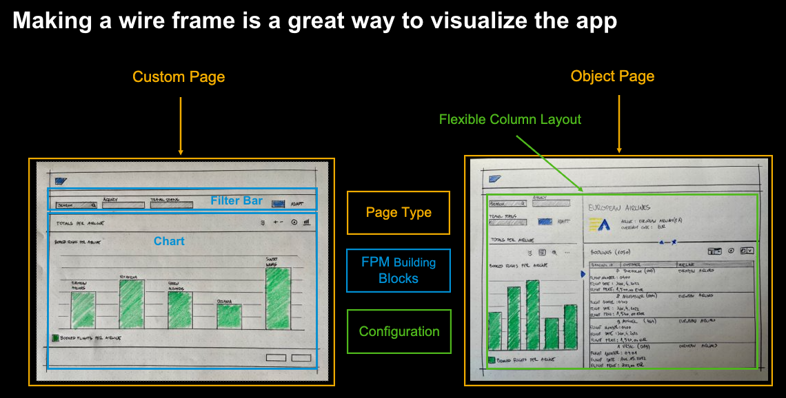

# UI5Con 2022 - Building SAP Fiori apps with flexible open-source modules

This repository contains the demo script and example service used at UI5Con 2022 in the session [“Building SAP Fiori apps with flexible open-source modules"](https://openui5.org/ui5con/germany2022/slides/2022-UI5con-1_7-Ashley-Tung-Final.pdf). The demo is intended show the amazing interplay between community projects, open UX tools, SAP Fiori tools and the SAP Fiori elements flexible programming model (FPM).

**Just to be clear:** this is a demo script, nothing else. This is not delivered software, a promise of future features, etc. There is also no guarantee that the demo works. It worked for us at UI5Con and we want it to work for you as well. So, if it doesn't work, just open an issue and we will look at it as soon as time permits. No response times guaranteed, but trust us, we care about you.

## Target Application


At the end of running through the demo script, you should have an app like [../demo-result/ui5con.demo.travel](../demo-result/ui5con.demo.travel)

## Before the Demo
**For this demo, we are using features of the SAP Fiori tools that are not yet fully released. To use the features, you need to use an unlisted feature flag. If you are interested in trying this demo script, please reach out to Ashley or Tobias and we will share the feature flag.**

We are using the `easy-ui5-generator` and `yo`, therefore both need to be globally installed.
```
npm i -g yo
npm i -g generator-easy-ui5
```

We are using Visual Studio Code for the demo, including any command that we run in a terminal. The commands can, of course, be executed in any terminal and it is also possible to run the very same demo in SAP Business Application Studio.

We are using a locally running server (included in this repo) for the demo so that we don't risk any issues with the network. To start the server:
```
cd server
npm i
npm start
```
The server should be running at http://localhost:4004

## Demo

### 1. Create application using easy-ui5 generator
* We are using the community driven easyUI5 generator to create our initial app
   * `yo easy-ui5 project`
   * The sub-generator `generator-ui5-project` has been enhanced with sub-generators to enable the new SAP Fiori elements flexible programming model
* While this generator is a community project, it uses modules provided as part of our `open-ux-tools` initiative (https://github.com/SAP/open-ux-tools) that aims to consolidate the core tooling functionality in an open source project that you can inspect, use, or contribute to
* Run the generator
    * The generator should be executed in a folder that is already in a VSCode workspace for simplicity
```
? What do you want to do? Create a new OpenUI5/SAPUI5 project
? How do you want to name this project? travel
? Which namespace do you want to use? ui5con.demo
? Do you want to enable the SAP Fiori elements flexible programming model? Yes
? Do you want the module to be visible in the SAP Fiori tools? Yes
? On which platform would you like to host the application? Static webserver
? Where should your UI5 libs be served from? Content delivery network (SAPUI5)
? Would you like to create a new directory for the project? Yes
? Would you like to add JavaScript code assist libraries to the project? Yes
? What type of page should be use for the main page? Custom Page
? What is the name of the page view? Main
? What is the url of the main service? http://localhost:4004/travel
? What entity should be used for the new page? BookedFlights
```
## 2. Show App in SAP Fiori tools and preview
* If VSCode is not open yet and your folder not part of the active workspace, open VSCode and add the project to the active workspace
* Open the SAP Fiori tools side panel
* Open the Application Info page
    * The generated project can be used with the SAP Fiori tools because the generator utilizes the `open-ux-tools` modules that are also the core of the SAP Fiori tools
* Start the preview

## 3. Show FPM Explorer and add FilterBar
* To add a building block the first time, we should look at the SAP Fiori elements for OData v4 flexbible programming model explorer (aka FPM Explorer) at https://ui5.sap.com/test-resources/sap/fe/core/fpmExplorer/index.html#/buildingBlocks/buildingBlockOverview 
* Select the `FilterBar` in the left pane to show a working `FilterBar` and its corresponding code and configuration
    * It is possible to change the code on the fly and see the results
    * We can remove the event handlers (which we don't need for today's app) and see that the building block still renders correctly
* Copy the `FilterBar` snippet
* Note:
    * Building blocks can only be used in FPM enabled apps, meaning apps that use the SAP Fiori elements controllers and component, as well as load the `sap.fe` libs
    * More information at https://ui5.sap.com/test-resources/sap/fe/core/fpmExplorer/index.html#/buildingBlocks/guidance/guidanceCustomApps

```
<macros:FilterBar metaPath="@com.sap.vocabularies.UI.v1.SelectionFields#SF1" id="FilterBar" />
```
* Open `MainView` in VSCode and paste the code above
* We need to remove the qualifier (which we don't need to have in our service) and add `xmlns:macros="sap.fe.macros"` to the root element
```xml
<mvc:View xmlns:core="sap.ui.core" xmlns:mvc="sap.ui.core.mvc" xmlns="sap.m"
  xmlns:html="http://www.w3.org/1999/xhtml" controllerName="ui5con.demo.travel.ext.main.Main" 
  xmlns:macros="sap.fe.macros">
  <Page title="Main">
    <content>
      <macros:FilterBar
        metaPath="@com.sap.vocabularies.UI.v1.SelectionFields#SF1"
        id="FilterBar"
      />
    </content>
  </Page>
</mvc:View>
```

* Of course, we could also do this without building blocks but since we have a well-annotated OData service here, we can make use of the building block to do less coding even in a freestyle app. In this case, adding the `FilterBar` building block to the view is all we need to add agency and travel status as filters in the filter bar because these two fields are specified in the annotations of the entity.

## 4. Add Chart
* To add a chart, we could use the FPM explorer again; however, for the `FilterBar` we just needed to copy the snippet for the building blocks. For the chart, we would also need to add chart-specific annotations.
* As an alternative, we are using the guided development extensions of the SAP Fiori tools to "guide" us through the "development" of a chart and its annotions
    * Open GD on the side
    * Select your project
    * Scroll to the custom page section
    * Select Add a Chart Building Block guide
    * Click on Start Guide
    * Fill the form (Entity Type: BookedFlights, any qualifier/title/description, Chart Type: Column, Measures Property: CountFlights, Dimension Property: AirlineID)
    * Click on Insert Snippet and Next
    * Enter relevant data (view, MyChart, Entity Type: BookedFlights)
    * Click on Insert Snippet
* We can now check the preview again and interact with the `FilterBar` to update the data shown in the `Chart`
* Note: there seems to be bug when changing the filter after the `FilterBar` is tied to the `Chart` that disables too much of the screen. To work around it, just wrap both building blocks in a `VBox` e.g. 

```xml
<VBox fitContainer="true" alignItems="Stretch" alignContent="Stretch" justifyContent="Start">
  <macros:FilterBar ... />
  <macros:Chart ... />
</VBox>
```

## 5. Add ObjectPage 
* While the main / start page is custom and does not match an SAP Fiori elements page type, from here we need to navigate into a standard SAP Fiori elements object page
* We can generate the configuration with the Application Modeler extension of the SAP Fiori tools
* Open the Page Map (using the SAP Fiori tools side panel again)
    * Select custom main page
    * Add navigation to new object page
    * Entity: `Airline`
* ALTERNATIVELY, we could also use the `easy-ui5` generator again
    * Change into the project directory
    * Execute `yo easy-ui5 project`
    * Select `newfpmpage`
```
? What type of page should be use for the main page? Object Page
? From what page do you want to navigate? BookedFlightsMain
? What entity should be used for the new page? Airline
? Overwrite uimodule/webapp/manifest.json? overwrite
```
* Both will result in exactly the same changes (this can be visualized best by checking the source control tab) because both are based on the same module from the `open-ux-tools` project

## 6: Implement Navigation
* Open `Main.controller` and add a simple event handler with an alert
```
onChartSelectionChanged: function(event) {
    var oData = event.mParameters.data[0].data;
    alert(oData);
}
```
* Open `Main.view` and add the reference to the event handler `selectionChange=".onChartSelectionChanged"`
* We can now test the initial code in our live preview by clicking on a bar in the chart
* Go back to code and add the actual navigation coding
```
if (event.mParameters.selected) {
    var oData = event.mParameters.data[0].data;
    var oRouter = this.getExtensionAPI().routing;
    oRouter.navigateToRoute('AirlineObjectPage', { AirlineKey: `'${oData.AirlineID}'` });
}
```
* We can use the SAP Fiori elements extension API and its routing component to do the navigation (and synching of bindings, etc.)
* We can go back to the preview and test the working navigation
## 7: Enable FCL
* Open Page Map (using the SAP Fiori tools side panel again)
* In the list of application properties, enable the flexible column layout (FCL)
* We can check the added configuration in the source control tab when selecting the `manifest.json`
* We can go back to the preview and test our final application
